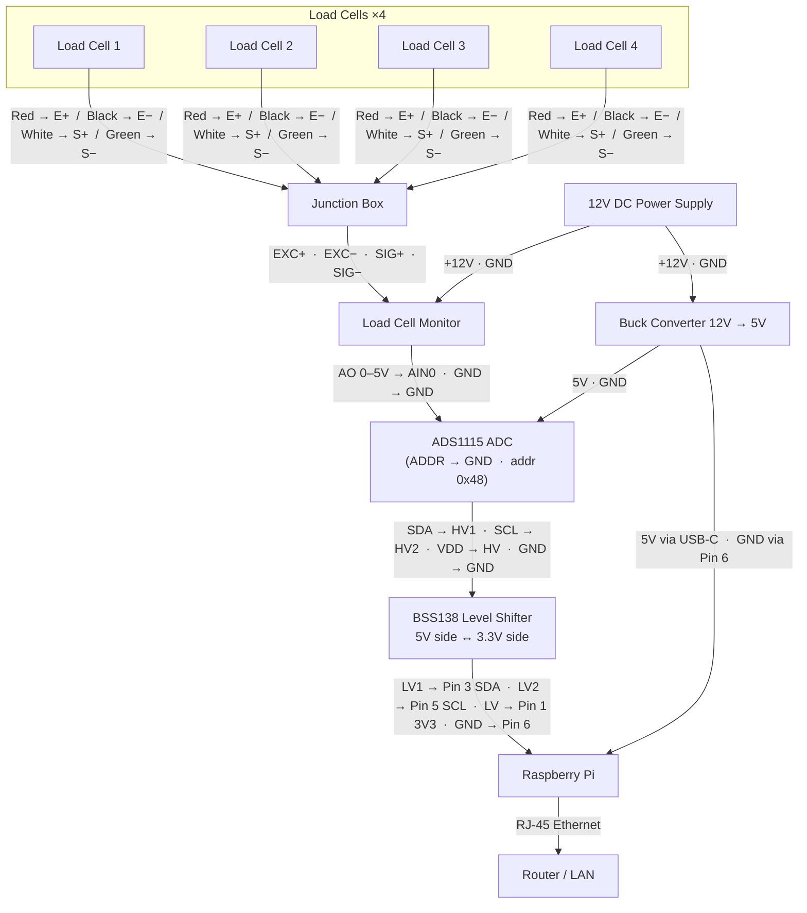

# IoT-Enabled Waste Monitoring and Characterization System

An IoT system that **weighs** an item placed on a load-cell scale, **identifies** it with computer vision, **categorizes** it (plastic, paper, metal, glass, organic, residual), **stores** the event locally, and shows it in a **real-time web dashboard** with analytics — all running on a Raspberry Pi.

## Hardware

| Component | Qty | Notes |
|---|---|---|
| Raspberry Pi (3/4/5) | 1 | Runs the whole stack. Connected to the router via Ethernet. |
| Load cells | 4 | Wired to the junction box to form a single Wheatstone bridge. |
| Load cell junction box | 1 | Combines the 4 load cells into E+/E−/S+/S− outputs. |
| External load cell monitor / signal conditioner | 1 | Powered by 12 V; outputs 0–5 V analog (AO + GND) to the ADS1115. |
| ADS1115 16-bit ADC | 1 | Powered at 5 V (from buck converter). Reads the 0–5 V signal on **AIN0**. I²C address 0x48 (ADDR → GND). |
| BSS138 bidirectional I²C level shifter | 1 | Translates 3.3 V Pi I²C ↔ 5 V ADS1115 logic. |
| Buck converter (12 V → 5 V) | 1 | Steps down the 12 V supply to 5 V for the Pi and ADS1115. |
| 12 V DC power supply (≥ 3 A) | 1 | Powers the load cell monitor directly, and the buck converter. |
| USB camera | 1 | Plugged into any Pi USB port. |
| Router | 1 | Pi connects via Ethernet for network access. |

Enable I²C on the Pi — see [step 1a below](#1a--enable-i2c).

## Wiring



> **Common ground:** Buck Converter VOUT−, ADS1115 GND, Level Shifter GND, Load Cell Monitor GND, and Pi Pin 6 must all share a single GND rail.

> **ADDR pin** on the ADS1115 tied to GND sets the I²C address to **0x48**. Verify with `i2cdetect -y 1`.

> **Buck converter** output must be trimmed to exactly **5.0 V** before connecting any load.

---

### Pin Reference Tables

#### Load Cells → Junction Box (all 4 cells identical)

| Wire colour | Junction Box terminal |
|---|---|
| Red | E+ |
| Black | E− |
| White | S+ |
| Green | S− |

#### Junction Box → Load Cell Monitor

| Junction Box | Load Cell Monitor |
|---|---|
| E+ | EXC+ |
| E− | EXC− |
| S+ | SIG+ |
| S− | SIG− |

#### 12V PSU → Load Cell Monitor & Buck Converter

| PSU | Load Cell Monitor | Buck Converter |
|---|---|---|
| +12V | VCC | VIN+ |
| GND | GND | VIN− |

#### Buck Converter (5V out) → Pi & ADS1115

| Buck Out | Destination |
|---|---|
| 5V | Pi USB-C (preferred) or GPIO Pin 2 / Pin 4 |
| GND | Pi GPIO Pin 6 |
| 5V | ADS1115 VDD |
| GND | ADS1115 GND |

#### Load Cell Monitor → ADS1115

| Monitor | ADS1115 |
|---|---|
| AO (0–5V) | AIN0 |
| GND / AGND | GND |

#### ADS1115 → Level Shifter (5V side)

| ADS1115 | Level Shifter |
|---|---|
| SDA | HV1 |
| SCL | HV2 |
| VDD (5V) | HV |
| GND | GND |
| ADDR | GND → sets address 0x48 |

#### Level Shifter (3.3V side) → Raspberry Pi

| Level Shifter | Pi Pin | Function |
|---|---|---|
| LV1 | Pin 3 | SDA1 (GPIO 2) |
| LV2 | Pin 5 | SCL1 (GPIO 3) |
| LV | Pin 1 | 3.3V reference |
| GND | Pin 6 | GND |

#### Raspberry Pi → Router

| Pi port | Cable | Router |
|---|---|---|
| RJ-45 Ethernet | Cat 5e / Cat 6 | Any LAN port |

---

### Power Budget

| Component | Rail | Typical draw |
|---|---|---|
| Raspberry Pi 4 | 5V (buck) | 600 mA idle · 1.2 A load |
| ADS1115 | 5V (buck) | < 1 mA |
| BSS138 level shifter | 3.3V / 5V | < 1 mA |
| Load cell monitor | 12V (PSU) | ~100–200 mA |
| USB camera | Pi USB 5V | 200–500 mA |
| **5V rail total** | **Buck** | **≈ 2 A peak** |

A **12V / 3A** (36 W) PSU with a buck converter rated ≥ 3 A is sufficient.


## Architecture

```
┌───────────────┐   ┌──────────────┐   ┌────────────┐
│   ADS1115     │──▶│              │   │  USB Cam   │
│  (AIN1, 5V)  │   │  Raspberry   │◀──│            │
└───────────────┘   │     Pi       │   └────────────┘
                    │              │
                    │   Python     │──▶ SQLite ──▶ Flask + SocketIO ──▶ Browser dashboard
                    │   services   │
                    └──────────────┘
```

A single Python process runs:
1. A background thread sampling the ADS1115 channel 1 voltage at ~10 Hz.
2. A stable-event detector that fires only when the derived weight is above a threshold **and** stable for a configurable window (ignores oscillation and adjustments).
3. On each event: capture a USB-camera frame → run a TFLite object detector → map the label to a waste category → save the image → insert a row in SQLite → push a Socket.IO message.
4. A Flask + Flask-SocketIO web server with a live dashboard and analytics page.

## How an Item is Recorded

When something is placed on the scale the system goes through the following steps:

```
Scale polling (~10 Hz)
    │
    ▼
StableEventDetector.push(grams)
    │  Collects a rolling window of samples.
    │  Fires only when:
    │    • weight ≥ min_weight_g (default 5 g)
    │    • stddev of last N samples ≤ stability_g (default 1 g)
    ▼
Pipeline._handle_event(weight_g)
    │
    ├─ camera.capture()           → grabs one frame from the USB camera
    ├─ detector.detect_all(frame) → TFLite EfficientDet identifies objects,
    │                               returns list of Detection(label, category, confidence)
    ├─ save_jpeg(frame, path)     → saves image to data/images/<uuid>.jpg
    │
    └─ for each detection:
           db.insert_event(...)   → writes one row to the waste_events SQLite table
           socketio.emit(...)     → pushes "new_event" to the live dashboard
```

**Important rules:**

| Rule | Detail |
|---|---|
| Event skipped if nothing detected | If the AI finds no recognisable object in the frame the event is still saved, but the category and label are recorded as **unknown** with 0% confidence. |
| Weight split equally | If multiple objects are detected in one frame the total weight is divided equally between them. |
| Reset required between events | After an event fires the weight must drop below `reset_threshold_g` (default 2 g) before the next event is accepted. |
| Bin capacity check | If the total weight reaches `events.capacity_kg` the pipeline pauses and the dashboard shows a "bin full" warning until the bin is emptied. |

---

## Project Layout

```
.
├── run.py                       # entrypoint
├── config.example.yaml          # copy to config.yaml and edit
├── requirements.txt             # base deps (work on any OS)
├── requirements-pi.txt          # Pi-only deps (ADS1115, ai-edge-litert)
├── app/
│   ├── config.py                # YAML config loader
│   ├── hardware/                # Scale + Camera (real + mock)
│   ├── ai/                      # Detector interface, TFLite impl, label maps
│   ├── core/                    # Pipeline, DB models, dataclasses
│   ├── web/                     # Flask app, routes, templates, static
│   │   └── templates/
│   │       ├── dashboard.html   # live weight + scale status + camera feed
│   │       ├── analytics.html   # charts
│   │       ├── settings.html    # database reset page
│   │       └── base.html
│   └── utils/                   # logging
├── scripts/
│   ├── calibrate_scale.py       # interactive tare + calibration (voltage-based)
│   ├── download_model.py        # fetches EfficientDet-Lite0 TFLite model
│   └── install_service.sh       # installs + enables the systemd service
├── tests/                       # pytest suite (uses mock hardware)
└── data/                        # SQLite db + captured images (gitignored)
```

---

## Quick Start (laptop / mock hardware)

You don't need a Pi to develop the dashboard — the system ships with a mock scale, mock camera, and mock detector.

### Windows

```powershell
python -m venv .venv
.venv\Scripts\Activate.ps1
pip install -r requirements.txt
Copy-Item config.example.yaml config.yaml   # already has use_mock: true
python run.py
```

### macOS / Linux

```bash
python -m venv .venv && source .venv/bin/activate
pip install -r requirements.txt
cp config.example.yaml config.yaml          # already has use_mock: true
python run.py
```

Open <http://localhost:5000>. The mock scale simulates items being placed and removed every few seconds; the dashboard updates live.

---

## Running on the Raspberry Pi

### 1 — System packages

```bash
sudo apt update
sudo apt install -y python3-pip python3-venv python3-opencv i2c-tools libopenblas-dev
```

### 1a — Enable I²C

**Option A — raspi-config (easiest)**

```bash
sudo raspi-config
```

Navigate to *Interface Options* → *I2C* → *Yes* → *Finish*, then reboot:

```bash
sudo reboot
```

**Option B — manual (Trixie / Bookworm)**

On Raspberry Pi OS Trixie and Bookworm the boot config is at `/boot/firmware/config.txt` (not `/boot/config.txt`):

```bash
# Add the I2C overlay if it is not already present
grep -q 'dtparam=i2c_arm=on' /boot/firmware/config.txt \
  || echo 'dtparam=i2c_arm=on' | sudo tee -a /boot/firmware/config.txt

# Make sure the i2c-dev module loads at boot
grep -q 'i2c-dev' /etc/modules \
  || echo 'i2c-dev' | sudo tee -a /etc/modules

sudo reboot
```

After the reboot, confirm the device node exists:

```bash
ls /dev/i2c*   # should show /dev/i2c-1
```

> **Note:** `libatlas-base-dev` was removed from Raspberry Pi OS Bookworm (Debian 12) and is not present in Trixie (Debian 13) either. Use `libopenblas-dev` instead — it provides the same BLAS/LAPACK functionality required by NumPy and SciPy on ARM.

### 2 — Verify the ADS1115 is detected on I²C

```bash
i2cdetect -y 1
# You should see 0x48 in the output
```

> If you get `Could not open file '/dev/i2c-1'`, I²C is not enabled yet — go back to **step 1a**.

### 3 — Python environment

```bash
python3 -m venv venv
source venv/bin/activate
pip install -r requirements.txt -r requirements-pi.txt
```

> **Note:** Raspberry Pi OS Bookworm/Trixie enforces an externally-managed Python environment.
> Always use a venv — never install packages system-wide with `pip` on the Pi.

### 4 — Download the TFLite model

```bash
python -m scripts.download_model
```

### 5 — Configure

**Step 1 — make a copy of the example config file**

```bash
cp config.example.yaml config.yaml
```

This creates your personal `config.yaml` from the provided template. You only edit `config.yaml` — never the `config.example.yaml` original.

---

**Step 2 — open the file in a text editor**

`nano` is a simple text editor built into Raspberry Pi OS. Type:

```bash
nano config.yaml
```

The file will open right in the terminal. You can scroll up/down with the arrow keys.

---

**Step 3 — change these two settings**

Find the line that says `use_mock: true` and change it to `false`:

```yaml
hardware:
  use_mock: false        # ← change true to false (tells the system to use real hardware)
```

Find the line that says `backend: mock` and change it to `tflite`:

```yaml
ai:
  backend: tflite        # ← change mock to tflite (uses the AI model you downloaded)
```

> **What is a YAML file?** It is a plain settings file. Each line is `setting-name: value`.  
> Lines that start with `#` are comments — they are ignored by the program, they are just notes for you.  
> **Indentation matters** — do not add or remove the spaces at the start of lines.

---

**Step 4 — save and exit nano**

1. Press **Ctrl + O** (the letter O, not zero) — this saves the file. Press **Enter** to confirm the filename.
2. Press **Ctrl + X** — this closes nano and returns you to the terminal.

---

**Step 5 — verify it saved correctly** *(optional but recommended)*

```bash
cat config.yaml
```

This prints the file so you can check your changes look right.

### 6 — Calibrate the scale

```bash
python -m scripts.calibrate_scale --known-weight 500
```

Follow the prompts:
1. Clear the platform → press Enter (captures tare voltage).
2. Place the known weight → press Enter (computes V/g calibration factor).

Copy the printed `tare_offset` and `calibration_factor` values into `config.yaml` under `hardware.scale`.

### 7 — Start the system

```bash
python run.py
```

You will see a line in the output like:

```
Web server listening on http://0.0.0.0:5000
```

> **Do not** type `http://0.0.0.0:5000` into your browser — that address means  
> "listen on every network interface" and cannot be opened directly.

**Find the Pi's real IP address** (open a second terminal or run this before starting):

```bash
hostname -I
```

This prints something like `192.168.1.105`. Use that number.

**Then open the dashboard:**

| Where you are | Address to type in your browser |
|---|---|
| On the Pi itself | `http://localhost:5000` |
| On another device (phone, laptop) on the same Wi-Fi | `http://192.168.1.105:5000` *(use your actual IP from `hostname -I`)* |
| Using hostname (after mDNS setup) | `http://Waste-Monitoring.local:5000` |

> **Tip:** To keep the server running after you close the terminal, see
> [Auto-start on boot](#auto-start-on-boot-systemd) or run it with `nohup python run.py &`.

---

## Accessing by Hostname (mDNS / .local)

Instead of typing an IP address, you can give the Pi a memorable hostname reachable as `http://Waste-Monitoring.local:5000` from any device on the same network — no internet required, works over both Wi-Fi and Ethernet.

### 1 — Install Avahi and set the hostname

```bash
sudo apt install -y avahi-daemon
sudo hostnamectl set-hostname Waste-Monitoring
```

### 2 — Fix /etc/hosts (prevents sudo warnings)

```bash
sudo sed -i "s/127.0.1.1.*/127.0.1.1\tWaste-Monitoring/" /etc/hosts
```

### 3 — Enable Avahi and reboot

```bash
sudo systemctl enable --now avahi-daemon
sudo reboot
```

After reboot, from any device on the same network:

```
http://Waste-Monitoring.local:5000
```

> **Windows:** mDNS (`.local`) is supported natively on Windows 10/11, macOS, iOS, and Android.
> If it does not resolve on an older Windows machine, install [Bonjour Print Services](https://support.apple.com/kb/DL999) (free).

### Optional — remove the port number

To access as just `http://Waste-Monitoring.local`, bind Flask to port 80 using `authbind`:

```bash
sudo apt install -y authbind
sudo touch /etc/authbind/byport/80
sudo chown pi /etc/authbind/byport/80
sudo chmod 755 /etc/authbind/byport/80
```

Edit `config.yaml`:

```yaml
web:
  host: 0.0.0.0
  port: 80
```

Then reinstall the service (the install script handles `authbind` automatically when port 80 is configured):

```bash
sudo bash scripts/install_service.sh
```

---

## Static IP & Local Network Access

The Flask server already binds to `0.0.0.0`, so every device on your Wi-Fi/LAN can reach it.  
Setting a **static IP** on the Pi gives it a predictable address you can bookmark like a website.

### Find your current network details first

```bash
ip route show default   # note: gateway IP and interface name (e.g. eth0 or wlan0)
ip addr show wlan0      # note: current IP and prefix length (e.g. 192.168.1.x/24)
```

---

### Raspberry Pi OS **Trixie** (Debian 13), **Bookworm** (Debian 12) — NetworkManager / `nmcli`

```bash
# List connection names
nmcli connection show

# Apply a static IP (replace values to match your network)
sudo nmcli connection modify "preconfigured" \
  ipv4.method manual \
  ipv4.addresses 192.168.1.100/24 \
  ipv4.gateway 192.168.1.1 \
  ipv4.dns "8.8.8.8 8.8.4.4"

sudo nmcli connection up "preconfigured"
```

> Replace `"preconfigured"` with your actual connection name shown by `nmcli connection show`.  
> Replace `192.168.1.100` with the address you want, and `192.168.1.1` with your router's IP.

---

### Raspberry Pi OS **Bullseye** (Debian 11) and older — `dhcpcd`

Add the following block to the **bottom** of `/etc/dhcpcd.conf`:

```
interface wlan0          # use eth0 for wired ethernet
static ip_address=192.168.1.100/24
static routers=192.168.1.1
static domain_name_servers=8.8.8.8 8.8.4.4
```

Apply:

```bash
sudo systemctl restart dhcpcd
```

---

### Access the dashboard

Once the static IP is set, open this in any browser on the same network:

```
http://192.168.1.100:5000
```

---

### Optional — remove the port number (access like a plain website)

Port 80 is the default HTTP port, so browsers don't require you to type `:5000`.  
Non-root processes cannot bind port 80 directly; use `authbind`:

```bash
sudo apt install -y authbind
sudo touch /etc/authbind/byport/80
sudo chown pi /etc/authbind/byport/80
sudo chmod 755 /etc/authbind/byport/80
```

Edit `config.yaml`:

```yaml
web:
  host: 0.0.0.0
  port: 80
```

Run via authbind directly:

```bash
authbind --deep venv/bin/python run.py
```

Or reinstall the systemd service — `install_service.sh` detects port 80 automatically:

```bash
sudo bash scripts/install_service.sh
```

Now the dashboard is reachable at:

```
http://192.168.1.100
```

---

## Auto-start on boot (systemd)

A setup script is provided that auto-detects the project path, venv, and current user:

```bash
sudo bash scripts/install_service.sh
```

This creates and enables `/etc/systemd/system/waste-monitor.service` automatically.

Useful commands after installation:

```bash
sudo systemctl status waste-monitor      # check if running
sudo systemctl restart waste-monitor     # restart after config changes
sudo systemctl stop waste-monitor        # stop
sudo systemctl disable waste-monitor     # remove from autostart
journalctl -u waste-monitor -f           # live logs
```

To run as a different user (e.g. not `pi`):

```bash
WASTE_USER=myuser sudo bash scripts/install_service.sh
```

---

## Deploying a New Build

Use this workflow every time you push updated code to the Pi.

### Option A — Git pull + service restart (recommended)

```bash
cd ~/IoT-Enabled-Waste-Monitoring-and-Characterization-System-with-Real-Time-Dashboard-and-Analytics
git pull
source venv/bin/activate
pip install -r requirements.txt -r requirements-pi.txt   # only needed if dependencies changed
sudo systemctl restart waste-monitor
```

Check it came back up:
```bash
sudo systemctl status waste-monitor
```

Watch live logs to confirm no errors:
```bash
journalctl -u waste-monitor -f
```

### Option B — Copy files manually (no Git on Pi)

From your **laptop / dev machine**, copy the updated project over SSH:

```powershell
# Windows (PowerShell) — run from the project root
scp -r . pi@Waste-Monitoring.local:~/IoT-Enabled-Waste-Monitoring-and-Characterization-System-with-Real-Time-Dashboard-and-Analytics/
```

```bash
# macOS / Linux
rsync -av --exclude '.venv' --exclude '__pycache__' --exclude 'data/' \
  ./ pi@Waste-Monitoring.local:~/IoT-Enabled-Waste-Monitoring-and-Characterization-System-with-Real-Time-Dashboard-and-Analytics/
```

Then SSH in and restart:

```bash
ssh pi@Waste-Monitoring.local
cd ~/IoT-Enabled-Waste-Monitoring-and-Characterization-System-with-Real-Time-Dashboard-and-Analytics
source venv/bin/activate
pip install -r requirements.txt -r requirements-pi.txt   # only if deps changed
sudo systemctl restart waste-monitor
sudo systemctl status waste-monitor
```

### Full reboot (only if required)

A plain service restart is enough for code changes. Only do a full reboot if you changed hardware wiring, the Pi's hostname, or a system-level config:

```bash
sudo reboot
```

The service starts automatically on boot (systemd). Wait ~30 seconds, then open:

```
http://Waste-Monitoring.local:5000
```

---

## Configuration Reference

All settings live in `config.yaml` (see `config.example.yaml` for the full annotated template).

| Key | Default | Description |
|---|---|---|
| `hardware.use_mock` | `true` | `false` to use real ADS1115 + USB camera |
| `hardware.scale.i2c_address` | `0x48` | ADS1115 I²C address (ADDR pin → GND) |
| `hardware.scale.gain` | `0.6667` | ADS1115 PGA: `0.6667`=±6.144 V, `1`=±4.096 V, `2`=±2.048 V. Value is snapped to nearest valid gain automatically. |
| `hardware.scale.tare_offset` | `0.0` | Sensor voltage (V) at zero weight — set by `calibrate_scale.py` |
| `hardware.scale.calibration_factor` | `1.0` | Volts per gram (V/g) — set by `calibrate_scale.py` |
| `hardware.scale.sample_rate_hz` | `10` | Target polling rate |
| `events.min_weight_g` | `5.0` | Minimum weight (g) to start a placement event |
| `events.stability_window` | `8` | Consecutive samples that must be within `stability_g` stddev |
| `events.stability_g` | `1.0` | Max stddev (g) to declare a stable reading |
| `events.reset_threshold_g` | `2.0` | Weight must drop below this to reset after an event |
| `events.capacity_kg` | `100.0` | Bin capacity — pipeline pauses when exceeded |
| `ai.backend` | `mock` | `mock` or `tflite` |
| `ai.model_path` | — | Path to `.tflite` model file |
| `ai.min_confidence` | `0.4` | Minimum detection confidence (0–1) |
| `database.url` | SQLite | SQLAlchemy URL (supports Postgres/MySQL too) |
| `web.host` / `web.port` | `0.0.0.0:5000` | Flask bind address |

---

## Web API

| Route | Description |
|---|---|
| `GET /` | Live dashboard — weight, scale status bar, camera feed, latest item |
| `GET /analytics` | Charts (per-category weight/counts, daily totals) |
| `GET /settings` | Settings page — reset database |
| `GET /api/events?limit=&offset=&category=&since=&until=` | List events (JSON) |
| `GET /api/summary?window=all\|today\|week` | Aggregate stats |
| `GET /api/daily?days=N` | Daily totals for the last N days |
| `GET /api/categories` | Category list |
| `GET /api/bin_status` | Current bin-full state and capacity |
| `POST /api/reset_db` | Delete all events and images, returns `{"deleted": N}` |
| `GET /api/events.csv` | Export all events as CSV |
| `GET /images/<event_id>` | Captured image for an event |
| `GET /video_feed` | MJPEG live camera stream |
| Socket.IO `weight` | Live weight stream (~10 Hz) |
| Socket.IO `scale_status` | Scale detector state (idle/stabilizing/cooldown + progress) |
| Socket.IO `new_event` | Pushed when a new placement is recorded |
| Socket.IO `bin_status` | Pushed when bin-full state changes |

---

## Tests

```bash
pip install -r requirements.txt
pytest -v
```

The test suite uses the mock scale, mock camera, and mock detector — no hardware required.

---

## Extending

* **Custom waste classifier:** swap the TFLite model and label-to-category map in `app/ai/labels.py` for a waste-specific classifier (e.g., TrashNet).
* **Different categories:** edit `DEFAULT_CATEGORIES` in `app/core/db.py` (the dashboard reads them dynamically).
* **Different DB:** point `database.url` at Postgres/MySQL — the SQLAlchemy layer handles it.
* **Different ADC channel:** change `Pin.A0` in `app/hardware/scale.py` to `Pin.A1`, `Pin.A2`, or `Pin.A3` to read from a different ADS1115 channel.
* **Reset database via UI:** go to `/settings` and click **Reset Database** to clear all events and images (useful during testing).
* **Diagnose scale issues:** the Live Weight card on the dashboard shows a real-time stability progress bar and the current detector state (idle / stabilizing / cooldown).
